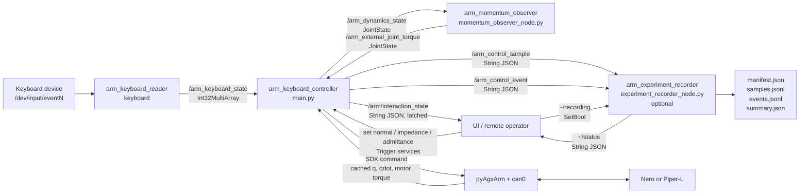
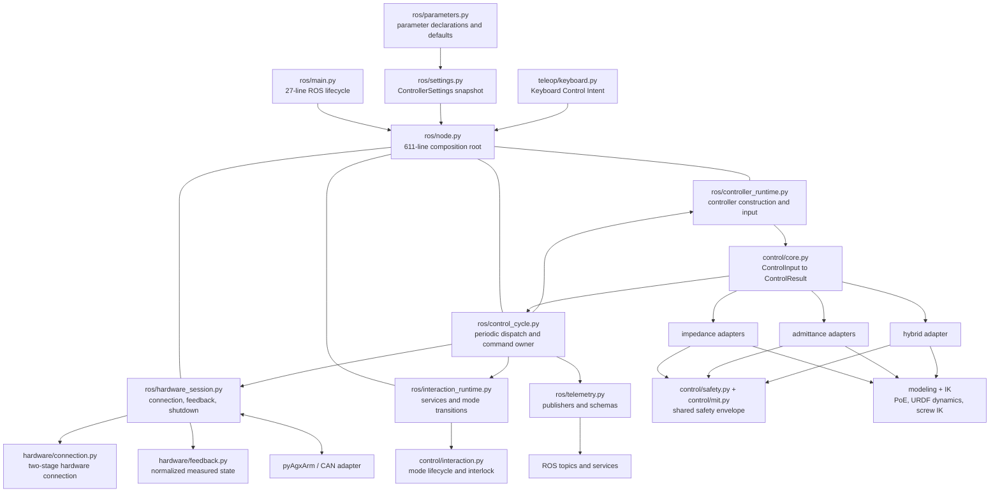
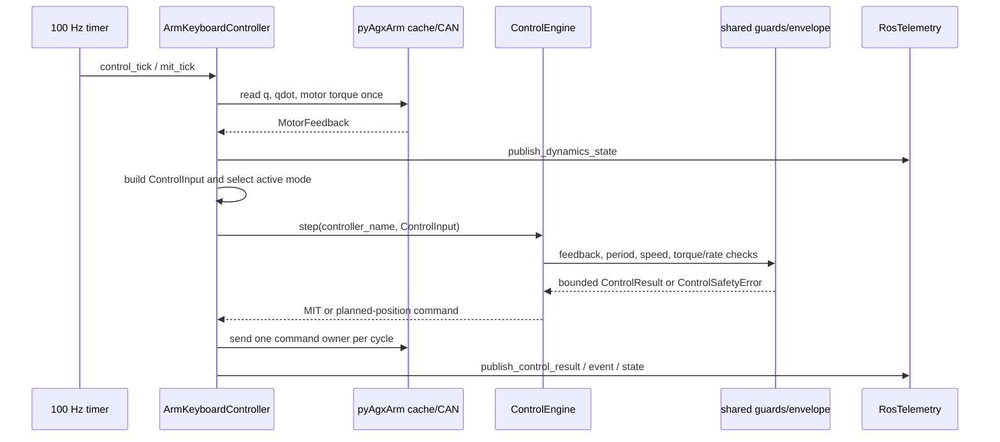

# ROS 节点连接与控制架构 / ROS Node Graph and Control Architecture

本文描述 `keyboard_control.launch.py` 当前实际启动和连接的节点，以及主控制进程
内部已经实现的 module 划分。实线表示当前代码路径，不表示未来设想。 / This
document describes the nodes and connections actually created by
`keyboard_control.launch.py`, plus the module structure already implemented
inside the main controller process. Solid lines are current code paths, not
future proposals.

## 1. ROS 节点连接图 / ROS node connection graph

默认启动键盘读取器、主控制节点和动量观测器。只有
`experiment_recording_enabled:=true` 时才启动记录器。动量观测器和记录器都不
访问 CAN，也不下发运动。 / The keyboard reader, main controller, and momentum
observer start by default. The recorder starts only when
`experiment_recording_enabled:=true`. Neither the observer nor recorder
accesses CAN or sends motion commands.

### Topic 合同 / Topic contracts

| Topic | 发布者 / Publisher | 订阅者 / Subscriber | 类型与语义 / Type and meaning |
| --- | --- | --- | --- |
| `/arm_keyboard_state` | `arm_keyboard_reader` | `arm_keyboard_controller` | `std_msgs/Int32MultiArray`; fixed 25-key state |
| `/arm_dynamics_state` | `arm_keyboard_controller` | `arm_momentum_observer` | `sensor_msgs/JointState`; measured `q`, `qdot`, motor torque |
| `/arm_external_joint_torque` | `arm_momentum_observer` | `arm_keyboard_controller` | `sensor_msgs/JointState`; observed external joint torque |
| `/arm_control_sample` | `arm_keyboard_controller` | optional recorder | `std_msgs/String`; schema-v1 JSON periodic evidence |
| `/arm_control_event` | `arm_keyboard_controller` | optional recorder | `std_msgs/String`; JSON discrete mode/safety event |
| `/arm/interaction_state` | `arm_keyboard_controller` | UI / remote clients | `std_msgs/String`; schema-v1 JSON, reliable + transient-local |
| `/arm_experiment_recorder/status` | optional recorder | UI / tooling | `std_msgs/String`; recorder state and run directory |

### Service 合同 / Service contracts

| Service | 类型 / Type | 语义 / Meaning |
| --- | --- | --- |
| `/arm/set_normal_mode` | `std_srvs/Trigger` | Idempotently request normal planned-position mode |
| `/arm/set_impedance_mode` | `std_srvs/Trigger` | Idempotently request impedance; cross-mode transitions pass through normal |
| `/arm/set_admittance_mode` | `std_srvs/Trigger` | Idempotently request admittance; cross-mode transitions pass through normal |
| `/arm_experiment_recorder/recording` | `std_srvs/SetBool` | Start or close an experiment run |

混合模式不在公开 service 能力中，当前只通过键盘 `H` 进入；状态 topic 仍会如实
报告 `hybrid`。 / Hybrid is not part of the public service capability and is
currently entered only with keyboard `H`; the state topic still reports
`hybrid` truthfully.

## 2. 主控制进程架构 / Main controller process architecture

`main.py` 只拥有 `rclpy.init/spin/shutdown` 生命周期。`node.py` 是当前 composition
root：它只保留参数派生对象构造、运行状态初始化以及 ROS topic/service/timer 接线。
四个内部 runtime mixin 分别集中 controller 构造、交互模式、硬件会话和控制周期；
它们不是对外插件 interface，组合后仍形成同一个 `ArmKeyboardController`，因此
callback 和实机调用顺序不变。公式继续由无 ROS/CAN 的 controller adapter 实现。 /
`main.py` owns only the `rclpy.init/spin/shutdown` lifecycle. `node.py` is the
composition root and retains only parameter-derived object construction,
runtime-state initialization, and ROS topic/service/timer wiring. Four
internal runtime mixins concentrate controller construction, interaction
modes, the hardware session, and the control cycle. They are not a public
plugin interface; together they still form one `ArmKeyboardController`, so
callback and hardware-call ordering stay unchanged. ROS/CAN-free controller
adapters continue to implement the equations.

`ControllerSettings` 在接触硬件前读取并校验启动设置，然后以冻结快照保留本次
运行配置；兼容安装步骤暂时保留原节点属性名，避免改变实机控制代码。 /
`ControllerSettings` reads and validates startup settings before hardware is
touched and retains a frozen snapshot for the run. A compatibility install
step temporarily preserves existing node attribute names so hardware-control
code does not change.

`RosTelemetry` 独占四个 publisher 和它们的 JSON/JointState schema；控制路径只
调用 `publish_*`，不再重复序列化细节。 / `RosTelemetry` exclusively owns the
four publishers and their JSON/JointState schemas; control paths call only
`publish_*` and no longer repeat serialization details.

## 3. 单周期数据流 / One-cycle data flow

任一周期只有一个模式拥有命令输出。跨阻抗、导纳或混合切换时，生命周期先提交
普通 planned-position 模式，再允许目标模式接管。 / Exactly one mode owns the
command output in a cycle. When crossing impedance, admittance, or hybrid
modes, the lifecycle first commits normal planned-position mode before the
target may take ownership.

## 4. 文件职责 / File ownership

当前完成的低风险拆分： / Completed low-risk splits:

- `ros/main.py`: executable lifecycle only.
- `ros/settings.py`: validated immutable startup snapshot.
- `ros/telemetry.py`: publisher ownership and message schemas.
- `ros/node.py`: 611-line construction and ROS wiring root.
- `ros/controller_runtime.py`: controller registry, normalized input, and telemetry delegation.
- `ros/interaction_runtime.py`: public services and normal-mediated interlock transitions.
- `ros/hardware_session.py`: two-stage connection, feedback, command transport, and shutdown.
- `ros/control_cycle.py`: keyboard dispatch, MIT/admittance/hybrid ticks, IK targets, and one command owner.

四个 runtime module 共享节点实例状态，这是为了原样保留已经验证的调用顺序；它们
只用于代码 locality，不作为可替换插件。未来若进一步减少共享状态，应先把硬件
session 做成显式对象并为调用顺序增加集成测试。 / The four runtime modules share
one node instance to preserve the validated call ordering exactly. They exist
for code locality and are not replaceable plugins. A future reduction in
shared state should first turn the hardware session into an explicit object
and add integration tests for call ordering.
