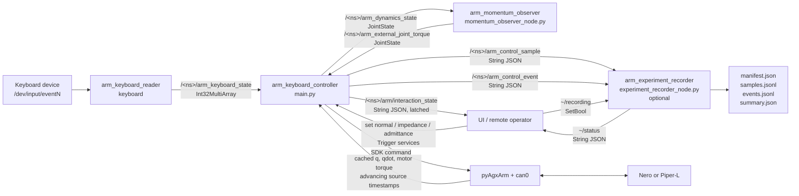
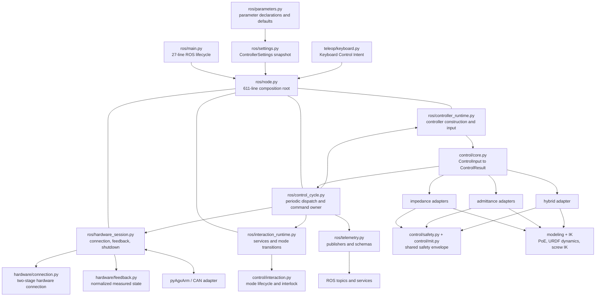
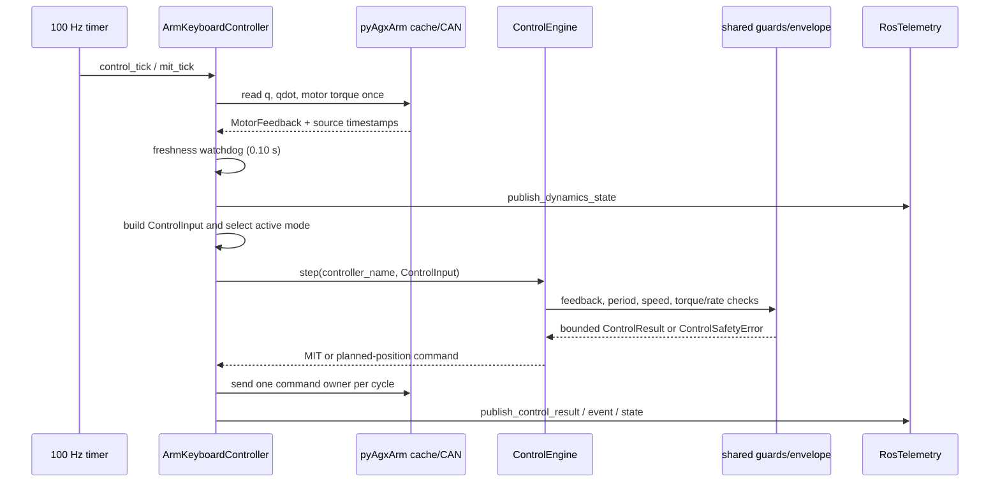

# ROS 节点连接与控制架构 / ROS Node Graph and Control Architecture

本文描述 `keyboard_control.launch.py` 当前实际启动和连接的节点，以及主控制进程
内部已经实现的 module 划分。实线表示当前代码路径，不表示未来设想。 / This
document describes the nodes and connections actually created by
`keyboard_control.launch.py`, plus the module structure already implemented
inside the main controller process. Solid lines are current code paths, not
future proposals.

下文的 `<ns>` 是机器人 DDS 命名空间：Nero 为 `nero`，Piper-L 为 `piper_l`。
启动文件的 `arm_namespace` 默认跟随 `robot_model`，两个封装脚本也显式传入该值。
/ `<ns>` below is the per-robot DDS namespace: `nero` for Nero and `piper_l`
for Piper-L. The launch `arm_namespace` defaults to `robot_model`, and both
wrapper scripts pass it explicitly.

## 1. ROS 节点连接图 / ROS node connection graph

默认启动键盘读取器、主控制节点和动量观测器。只有
`experiment_recording_enabled:=true` 时才启动记录器。动量观测器和记录器都不
访问 CAN，也不下发运动。 / The keyboard reader, main controller, and momentum
observer start by default. The recorder starts only when
`experiment_recording_enabled:=true`. Neither the observer nor recorder
accesses CAN or sends motion commands.

机器人 YAML 为 controller/observer 分别提供默认模型参数；显式 launch
`tool_configuration:=...` 覆盖会同步传给两个节点，保证控制力矩和观测残差使用同一
末端负载。 / Robot YAML supplies defaults to controller and observer
separately; an explicit launch `tool_configuration:=...` override is mirrored
to both so control torque and observer residual use the same payload model.

### Topic 合同 / Topic contracts

| Topic | 发布者 / Publisher | 订阅者 / Subscriber | 类型与语义 / Type and meaning |
| --- | --- | --- | --- |
| `/<ns>/arm_keyboard_state` | `/<ns>/arm_keyboard_reader` | `/<ns>/arm_keyboard_controller` | `std_msgs/Int32MultiArray`; fixed 25-key state |
| `/<ns>/arm_dynamics_state` | `/<ns>/arm_keyboard_controller` | `/<ns>/arm_momentum_observer` | `sensor_msgs/JointState`; measured `q`, `qdot`, motor torque |
| `/<ns>/arm_external_joint_torque` | `/<ns>/arm_momentum_observer` | `/<ns>/arm_keyboard_controller` | `sensor_msgs/JointState`; observed external joint torque |
| `/<ns>/arm_control_sample` | `/<ns>/arm_keyboard_controller` | optional recorder | `std_msgs/String`; schema-v1 JSON periodic evidence |
| `/<ns>/arm_control_event` | `/<ns>/arm_keyboard_controller` | optional recorder | `std_msgs/String`; JSON discrete mode/safety event |
| `/<ns>/arm/interaction_state` | `/<ns>/arm_keyboard_controller` | UI / remote clients | `std_msgs/String`; schema-v1 JSON, reliable + transient-local; `mode_services` uses resolved FQN/remapped names |
| `/<ns>/arm_experiment_recorder/status` | optional recorder | UI / tooling | `std_msgs/String`; recorder state and run directory |

### Service 合同 / Service contracts

| Service | 类型 / Type | 语义 / Meaning |
| --- | --- | --- |
| `/<ns>/arm/set_normal_mode` | `std_srvs/Trigger` | Idempotently request normal planned-position mode |
| `/<ns>/arm/set_impedance_mode` | `std_srvs/Trigger` | Idempotently request impedance; cross-mode transitions pass through normal |
| `/<ns>/arm/set_admittance_mode` | `std_srvs/Trigger` | Idempotently request admittance; cross-mode transitions pass through normal |
| `/<ns>/arm_experiment_recorder/recording` | `std_srvs/SetBool` | Start or close an experiment run |

混合模式不在公开 service 能力中，当前只通过键盘 `H` 进入；状态 topic 仍会如实
报告 `hybrid`。 / Hybrid is not part of the public service capability and is
currently entered only with keyboard `H`; the state topic still reports
`hybrid` truthfully.

evdev 读取器在 EOF、短读或致命错误时锁存故障、清零全部 25 个键，并继续发布全零
状态，因此设备拔出不会把最后一次按下状态永久保留。 / On evdev EOF, a partial
read, or a fatal error, the reader latches the fault, clears all 25 keys, and
keeps publishing zero, so unplugging a device cannot preserve the last pressed
state indefinitely.

命名空间防止两种机械臂的 DDS endpoint 互相配对，但不隔离 CAN。两个封装脚本仍
默认使用 `can0`；除非物理总线拓扑明确支持，否则不得让两个硬件控制器同时占用
同一 CAN interface。 / Namespaces prevent the two robots' DDS endpoints from
matching each other, but they do not isolate CAN. Both wrappers still default
to `can0`; do not attach two hardware controllers to the same CAN interface
unless the physical bus topology explicitly supports it.

## 2. 主控制进程架构 / Main controller process architecture

`main.py` 只拥有 `rclpy.init/spin/shutdown` 生命周期。`node.py` 是当前 composition
root：它只保留参数派生对象构造、运行状态初始化以及 ROS topic/service/timer 接线。
四个内部 runtime mixin 分别集中 controller 构造、交互模式、硬件会话和控制周期；
它们不是对外插件 interface，组合后仍形成同一个 `ArmKeyboardController`，因此
callback 和实机调用顺序不变。公式继续由无 ROS/CAN 的 controller adapter 实现。 /
`main.py` owns only the `rclpy.init/spin/shutdown` lifecycle. `node.py` is the
composition root and retains only parameter-derived object construction,
runtime-state initialization, and ROS topic/service/timer wiring. Four
internal runtime mixins concentrate controller construction, interaction
modes, the hardware session, and the control cycle. They are not a public
plugin interface; together they still form one `ArmKeyboardController`, so
callback and hardware-call ordering stay unchanged. ROS/CAN-free controller
adapters continue to implement the equations.

`ControllerSettings` 在接触硬件前读取并校验启动设置，然后以冻结快照保留本次
运行配置；兼容安装步骤暂时保留原节点属性名，避免改变实机控制代码。 /
`ControllerSettings` reads and validates startup settings before hardware is
touched and retains a frozen snapshot for the run. A compatibility install
step temporarily preserves existing node attribute names so hardware-control
code does not change.

`RosTelemetry` 独占四个 publisher 和它们的 JSON/JointState schema；控制路径只
调用 `publish_*`，不再重复序列化细节。 / `RosTelemetry` exclusively owns the
four publishers and their JSON/JointState schemas; control paths call only
`publish_*` and no longer repeat serialization details.

## 3. 单周期数据流 / One-cycle data flow

任一周期只有一个模式拥有命令输出。退出阻抗、导纳或混合时，先用请求后的新状态
确认 MOVE_J，再成功发送实测位置持位，最后才由生命周期提交普通模式；跨模式时
目标模式随后才能接管。 / Exactly one mode owns command output in a cycle.
When leaving impedance, admittance, or hybrid, a fresh post-request status must
confirm MOVE_J and the measured-position hold must succeed before the lifecycle
commits normal; only then may a cross-mode target take ownership.

带时间戳的关节角和每个电机状态源必须先被观察到至少推进一次，之后全部源都超过
上一完整 bundle 才刷新控制反馈；首次读到的历史缓存不能进入 MIT。阻抗运行中，
任一源停止推进超过 `0.10 s` 时不再发送 MIT 力矩；
节点仅用看门狗保存的最后完整实测姿态尝试切回普通 planned-position。handoff 只
额外允许一个名义 MIT 周期，且逐关节 `abs(qdot) * sample_age <= 0.03 rad`；过旧、
位移不确定度超限、模式确认失败或持位发送失败均急停。单次 SDK 读取异常在该窗口
内复用 bounded cache，不会因一个瞬时错误立即切换。 / Every timestamp-bearing
joint-angle and motor-state source must first be observed advancing; a historical
cache from the first read cannot enter MIT. Later bundles refresh only after
every source advances beyond the last accepted bundle. During active impedance, if any
source stops advancing for more than `0.10 s`, MIT torque output stops. The node
attempts normal planned-position handoff only with the watchdog's last complete
measured pose. Handoff gets one additional nominal MIT period and requires
per-joint `abs(qdot) * sample_age <= 0.03 rad`; an old or uncertain sample,
failed mode confirmation, or failed hold command E-stops. A single SDK read
error reuses the bounded cache within the window instead of switching on one
transient miss.

## 4. 文件职责 / File ownership

当前完成的低风险拆分： / Completed low-risk splits:

- `ros/main.py`: executable lifecycle only.
- `ros/settings.py`: validated immutable startup snapshot.
- `ros/telemetry.py`: publisher ownership and message schemas.
- `ros/node.py`: 611-line construction and ROS wiring root.
- `ros/controller_runtime.py`: controller registry, normalized input, and telemetry delegation.
- `ros/interaction_runtime.py`: public services and normal-mediated interlock transitions.
- `ros/hardware_session.py`: two-stage connection, feedback, command transport, and shutdown.
- `ros/control_cycle.py`: keyboard dispatch, MIT/admittance/hybrid ticks, IK targets, and one command owner.

四个 runtime module 共享节点实例状态，这是为了原样保留已经验证的调用顺序；它们
只用于代码 locality，不作为可替换插件。未来若进一步减少共享状态，应先把硬件
session 做成显式对象并为调用顺序增加集成测试。 / The four runtime modules share
one node instance to preserve the validated call ordering exactly. They exist
for code locality and are not replaceable plugins. A future reduction in
shared state should first turn the hardware session into an explicit object
and add integration tests for call ordering.
